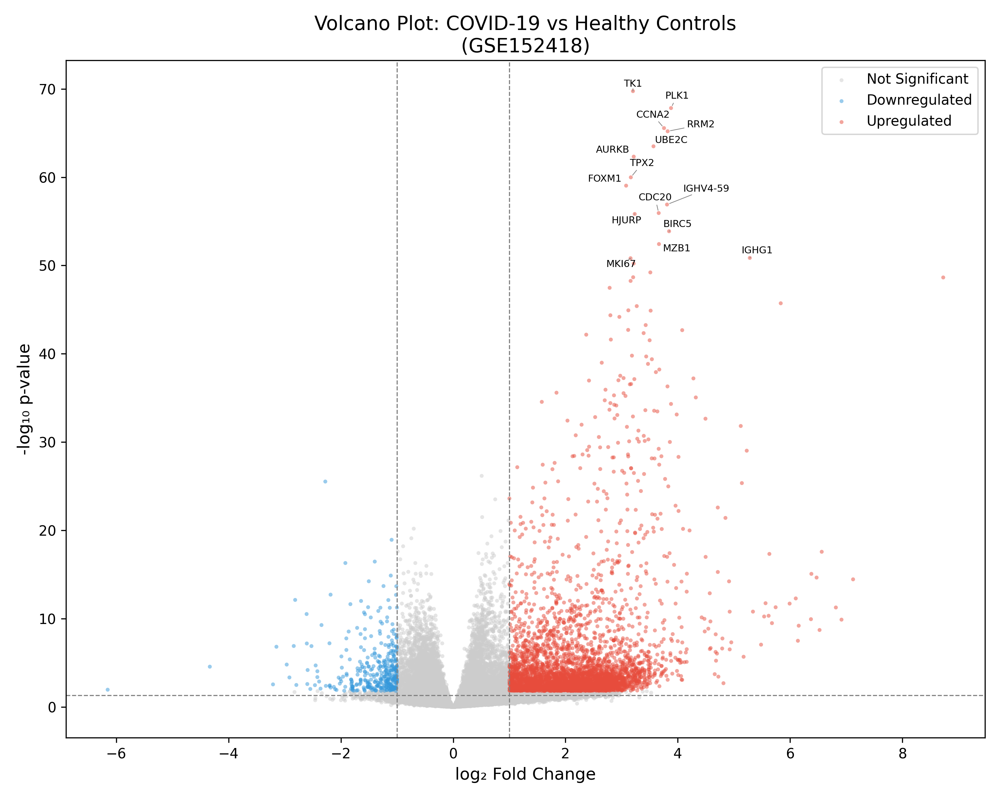
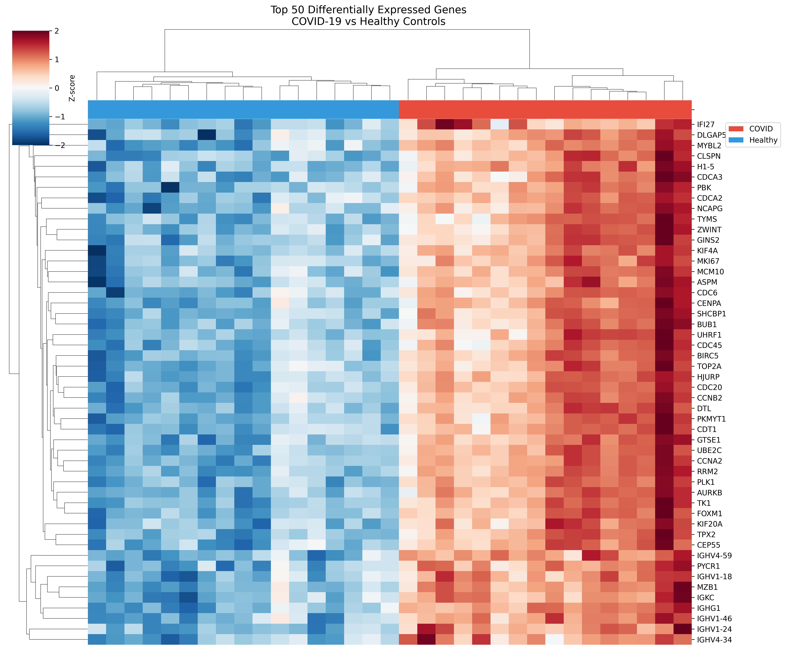
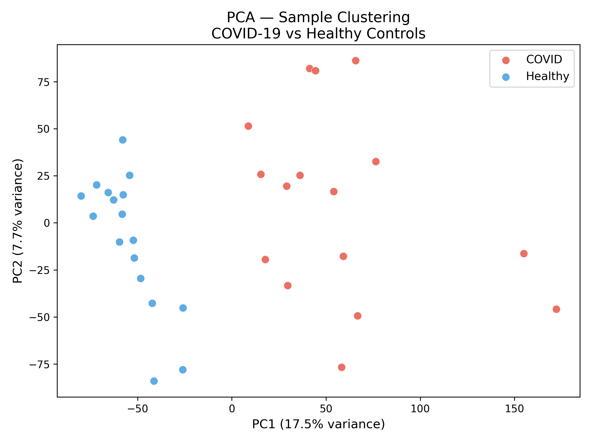
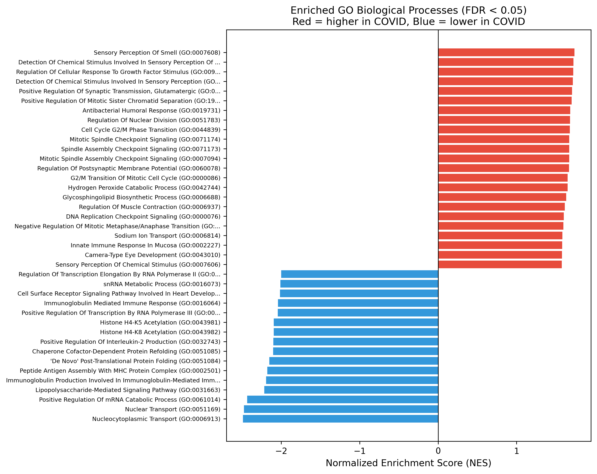
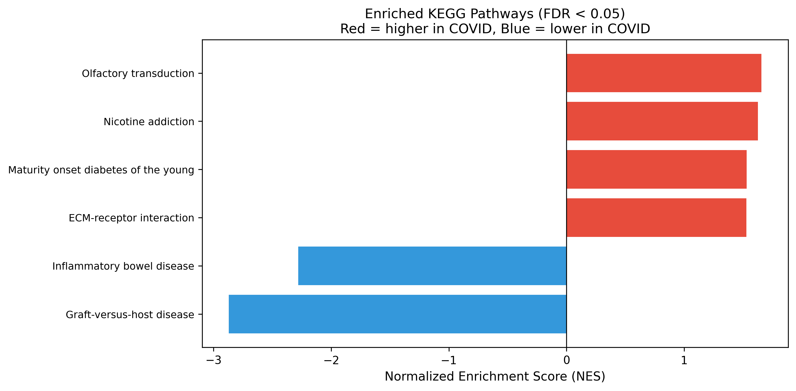

# COVID-19 Blood Transcriptomics Re-analysis (GSE152418)

This is a re-analysis of a publicaly available RNA-seq dataset to compare blood gene expression in COVID-19 patients vs healthy controls. The goal of this project was independent learning to practice bioinformatics analysis using Python.

## Dataset

- **Source:** [GSE152418](https://www.ncbi.nlm.nih.gov/geo/query/acc.cgi?acc=GSE152418) from GEO
- **Original paper:** Arunachalam et al., *Science* (2020)
- **Samples:** 16 COVID-19 patients + 17 healthy controls
- **Blood Component:** PBMCs
- **Platform:** Illumina NovaSeq 6000

## What I Did

1. Downloaded and explored the raw count data from GEO. The table contained genes as rows, patients as columns, and each number is how much activity that gene showed in that person's blood sample.
2. Ran differential expression analysis using PyDESeq2 (COVID vs Healthy)
3. Created visualizations — volcano plot, heatmap, PCA.
4. Ran gene set enrichment analysis (GSEA) using GSEApy
5. Interpreted the results and compared with published findings

## Results

Found **4,289 significantly differentially expressed genes**. Top genes were mostly related to cell division (PLK1, CCNA2, CDC20) and antibody production (IGHV4-59, IGHG1). IFI27, a known COVID biomarker, had the highest fold change.

### Volcano Plot

### Heatmap — Top 50 DEGs

### PCA

### Enriched Pathways

## Tools Used

- Python 3, Jupyter Notebook
- PyDESeq2 — differential expression
- GSEApy — pathway analysis
- matplotlib, seaborn — plotting
- mygene — gene ID conversion to gene names

## How to Run

1. Clone this repo
2. Install dependencies: `pip install -r requirements.txt`
3. Download count data from [GEO GSE152418](https://www.ncbi.nlm.nih.gov/geo/query/acc.cgi?acc=GSE152418) and place in `data/`
4. Run the notebook: `covid19_rnaseq_analysis.ipynb`

## Author

**Shristi Maurya** — M.Tech. Biotechnology, Assistant Professor
